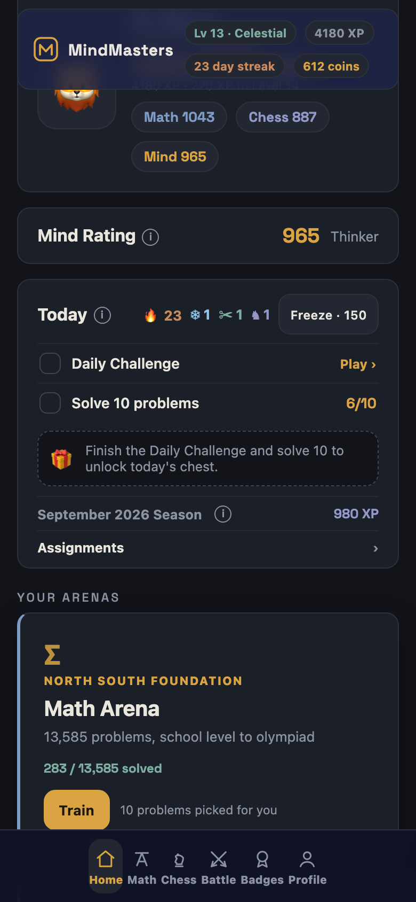

# MindMasters Academy

Two kids tap the same Train button. The one rated 800 gets a counting problem off an old AMC 8, the one rated 1400 gets algebra out of an AIME, and neither of them chose a difficulty or saw a problem they'd already solved. That's the whole trick, and it's the thing I wanted for my own students: I coach North South Foundation math and CheckMates chess, and a room of kids is never one difficulty level.

It's free and it's at [prathammukewar.github.io/mindmasters](https://prathammukewar.github.io/mindmasters/). Parents and coaches usually want [the longer explanation](https://prathammukewar.github.io/mindmasters/about/) first.

## The problems are real ones

Every AMC 8 back to 1999, every AMC 10 and 12 back to 2000, every AIME back to 1983. Official answers, the original diagrams, and a link to the AoPS solution on each problem. 13,585 of them, and not one is invented, because a made-up "AMC-style" question teaches a kid to expect the wrong thing in November.

Chess is 13,531 rated puzzles and an engine that plays a real game, so the same account does tactics on Tuesday and a full pass-and-play match on Wednesday.

## What a session is

Ten problems, chosen against your rating, pulled from every topic at once instead of one chapter at a time. Get one wrong and it comes back tomorrow. Math and chess each carry their own rating, the profile draws a line of every rated game you've played, and there's a streak, a daily challenge, monthly seasons, an avatar shop and a chest that only opens once the day's checklist is done. None of that is subtle. It isn't supposed to be, it's aimed at nine-year-olds.



## Handing it to a class

Build an assignment, read out the code, and students paste it in. They send back a submission code when they're done, which fills in your roster, flags whoever skipped it, and shows which problem tripped the most kids. Nobody makes an account and nothing needs a connection. If you'd rather have a live leaderboard there's an optional free Firebase setup, explained inside the app. `docs/` has a quick start and a one-pager you can hand to a coordinator.

## Editing it

`index.html`, `MindMasters_Academy.html` and `sw.js` are generated, so edit the part files and rebuild:

```
python3 assemble.py
```

The whole app is one HTML file with every problem, diagram and font inlined. That's the trade: a 21 MB first load, and after that it runs offline forever, off a school Chromebook with the wifi down or off a file on a USB stick.

```
npm i playwright && npx playwright install chromium
node test_v12.js && node test_v12b.js && node test_v13.js && node test_v17.js && node test_v18.js && node test_v20.js && node test_v21.js && node test_v22.js && node test_v23.js && node test_v24.js && node test_v25.js
```

## What isn't done

Progress lives in one browser on one device. There's a backup code that carries an account somewhere else, but that's a workaround for the real fix, which is accounts that sync, and I haven't built that yet.

The bigger gap is that nobody has used this for a whole season. I know the rating picks the right problem, because I can measure that. What I don't know is whether a rating is enough to bring a kid back on a Thursday when nothing is due, and my own students are about to be the ones who tell me.

---

AMC and AIME problems are copyright the Mathematical Association of America and appear here for practice. Chess positions come from public game records. MIT licensed.
